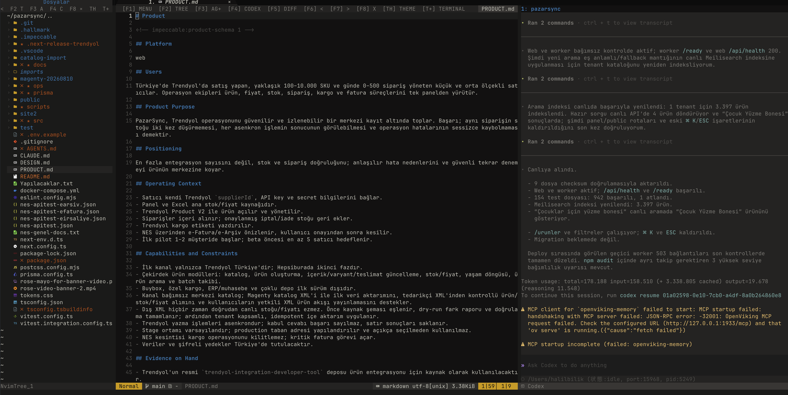

# Neovim Codex Workbench

A mouse-friendly, desktop-style Neovim configuration for AI-assisted coding. It combines a file explorer, a real centre editor, Codex sessions, independent terminal tabs, inline Git/Codex diffs, media previews, diagnostics, and switchable dark/light themes in one layout.

The default interface is intentionally usable without memorising a leader-key prefix: the header exposes the main actions and global function keys work from normal, insert, visual, and terminal mode.

The screenshot shows the intended three-pane workflow: project files on the left, the active document and diff in the centre, and Codex/agent output on the right.

## Highlights

- **Codex in the editor**: embedded Codex terminal, multiple Codex agent tabs, YOLO-aware diff approval, automatic scroll-to-input, and file changes opened in the centre editor.
- **Reliable inline diffs**: the current file remains the only centre buffer; additions are green and removed/reference text is red regardless of the selected theme. Git index/HEAD snapshots are used as the comparison baseline, including untracked files.
- **Mouse-friendly file workflow**: NvimTree, clickable header/menu, buffer tabs with a visible x, middle-click closing, and safe routing of file-tab clicks away from terminal panels.
- **Independent terminals**: create separate Shell, Codex, OpenCode, Claude Code, or custom command sessions without replacing the managed Codex pane.
- **Rich previews**: Glimpse previews images, video, archives, SQLite, documents, diagrams, and other formats when the terminal/protocol and optional tools are available.
- **Navigation and diagnostics**: Treesitter highlighting/indentation, Trouble, GitSigns, Diffview, Browse, and mini.nvim utilities.
- **Themes**: Flexoki Dark is the default; Catppuccin, Kanagawa, and Flexoki dark/light choices are available from the header or :ThemeSelect.
- **Console transcripts**: console-*.log buffers are presented without editor line numbers/sign noise and highlight timestamps, URLs, and log levels.

## Requirements

- Neovim **0.10 or newer** (0.12 is recommended for the current compatibility shims).
- Git and a terminal with true-colour support. A Nerd Font is optional; the UI keeps text fallbacks for terminals without Nerd Font glyphs.
- codex is optional but required for Codex features. codex-acp is used when installed; otherwise CodeCompanion can fetch the adapter with npx.
- Glimpse media features are optional. For the full preview surface install ImageMagick (magick) and, for video thumbnails/playback, ffmpeg. Other formats may use f3d, Blender, sqlite3, file, xxd, openssl, PlantUML, Mermaid CLI, or a Markdown renderer.

## Install

Back up an existing configuration, then clone this repository as Neovim's config directory:

~~~bash
mv ~/.config/nvim ~/.config/nvim.backup.$(date +%Y%m%d-%H%M%S)
git clone https://github.com/NeronSignal/VibeVim.git ~/.config/nvim
nvim
~~~

lazy.nvim bootstraps itself on the first launch and installs the declared plugins. If you already manage Neovim with another distribution, copy init.lua and lazy-lock.json into a test profile first rather than replacing your existing setup.

### Codex credentials and provider settings

No credentials are stored in this repository. Configure the Codex CLI using its normal login/configuration flow, or provide your own OpenAI-compatible provider through environment variables before starting Neovim. The configuration recognises CODEX_MODEL, CODEX_THOUGHT_LEVEL, CODEX_MODEL_PROVIDER, CODEX_OCEANAPI_BASE_URL, CODECOMPANION_OCEANAPI_URL, and OCEANAPI_API_KEY.

Keep API keys in your shell/keychain; never commit them to init.lua or a dotfile override.

## Quick controls

| Key | Action |
| --- | --- |
| F1 | Open/close the control centre |
| F2 | Toggle the file tree |
| F3 | Open another Codex agent terminal |
| F4 | Toggle the managed Codex terminal |
| F5 | Open the Codex/Git inline diff |
| F6 / F7 | Previous/next file tab |
| F8 | Safely close the current file tab |
| F10 | Toggle Trouble diagnostics |
| F11 | Open this Neovim configuration |
| F12 | Open lazy.nvim |
| Ctrl-Tab | Next file tab |
| Ctrl-S | Save the current buffer |
| :TerminalNew | Choose Shell, Codex, OpenCode, Claude, or a custom terminal command |
| :ThemeSelect | Choose a dark or light theme |
| :CodexDiff [path] | Show one file's inline diff in the centre editor |

The complete mouse and keymap reference is available from F1 → ? or :NvimShortcuts.

## Development

The configuration is intentionally a single readable init.lua. Make changes on a branch, start Neovim with a clean test profile, and validate headlessly before opening a pull request:

~~~bash
nvim --headless -u ./init.lua -c 'lua print(vim.g.colors_name)' -c 'qa!'
~~~

Please include the Neovim version, terminal emulator, operating system, and the relevant :messages output when reporting a bug. Do not include credentials or private project logs.

## Contributing

Issues and pull requests are welcome. Keep provider-specific endpoints, tokens, and machine-local paths out of commits. Small focused changes with a reproducible test case are easiest to review.

## License

MIT. See LICENSE.

---

# Neovim Codex Workbench (Türkçe)

Yapay zekâ destekli kodlama için fare kullanımını kolaylaştıran, masaüstü tarzı bir Neovim yapılandırmasıdır. Dosya ağacı, merkez editör, Codex oturumları, bağımsız terminal sekmeleri, Git/Codex satır içi diff, medya önizleme ve tanı araçları tek düzende çalışır.

Eklenen kod her temada **yeşil**, çıkarılan/eski referans kodu **kırmızı** gösterilir. console-*.log dosyaları satır numarası karmaşası olmadan console görünümünde açılır; ERROR, WARN, INFO ve LOG seviyeleri renklendirilir.

Varsayılan tema Flexoki Dark'tır; header'daki tema düğmesinden veya :ThemeSelect komutundan diğer koyu/açık temalara geçebilirsiniz.

Kurulum için mevcut ~/.config/nvim klasörünü yedekleyip depoyu klonlayın. Eklentiler ilk açılışta lazy.nvim tarafından kurulur. API anahtarlarını repoya yazmayın; Codex girişini ve sağlayıcı ayarlarını ortam değişkenleri veya kendi Codex yapılandırmanız üzerinden yapın.

Katkı göndermek için bir branch açın, temiz bir test profiliyle Neovim'i başlatın ve işletim sistemi/terminal/Neovim sürümünü açıklayın. Gizli anahtarları, özel endpoint'leri ve proje loglarını commit etmeyin.
